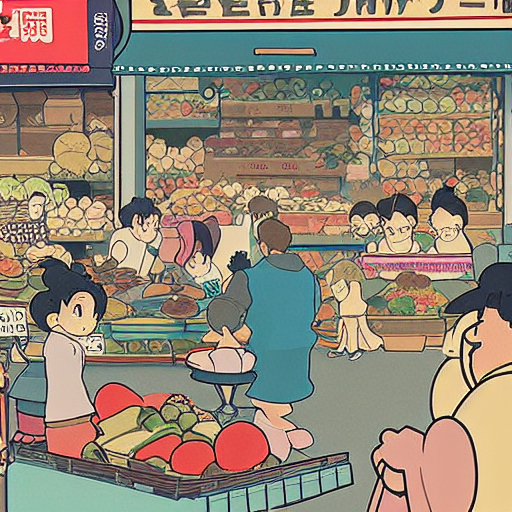
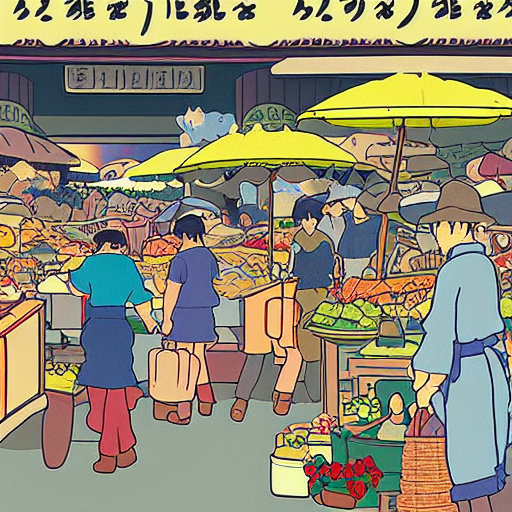
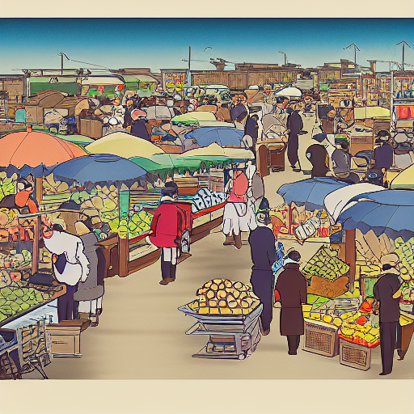
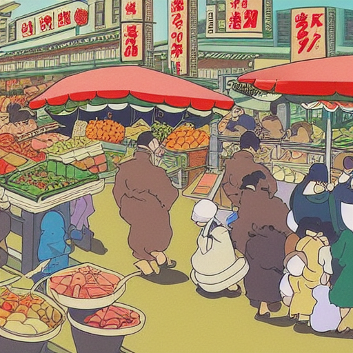
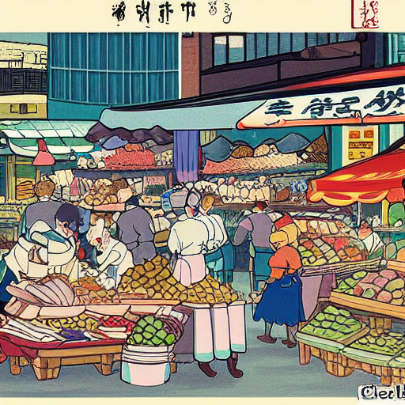
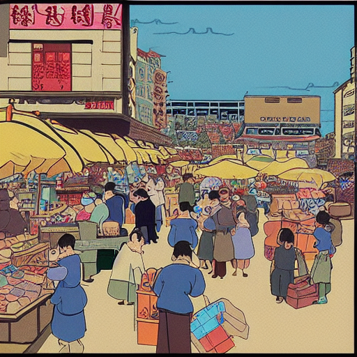

# Stable Diffusion 1.5 Style LoRA

Team members: IvanYachUkr, Claudius, stellamoR.

This project fine-tunes Stable Diffusion 1.5 with LoRA adapters on both the UNet
and CLIP text encoder. It also adds `<sks>` as one tokenizer token and trains its
embedding. The required prompt is:

```text
a busy market, in <sks> style
```

The selected adapter is `lora_out/pytorch_lora_weights.safetensors`, SHA-256
`606190249fe5df2d4c36bb48552cb9837bfcc91e8388ef85abe25688ad71c788`.

## Contents

- `code/train_lora.py`: deterministic dual-LoRA training and resume support.
- `code/eval_lora.py`: deterministic sample generation with no adapter-scale option.
- `training_data`: 60 self-contained auxiliary images and their provenance manifest.
- `experiment_data`: 96 supplied-image crops used by the balanced-data experiment.
- `experiments/clean_campaign`: schedules, traces, metrics, sessions, and visual reviews.
- `lora_out/pytorch_lora_weights.safetensors`: final adapter and token embedding.
- `models`: eligible comparison checkpoints from the clean training campaign.
- `samples`: six final images and checkpoint comparison grids.
- `reproducibility/self_market_step150`: exact selected-run records.
- `docs/lora_training_algorithm.md`: training and evaluation contract.
- `report.pdf`: two-page assignment report.

## Installation

Python 3.10 or newer and a CUDA GPU are recommended.

```bat
python -m venv .venv
.venv\Scripts\activate
python -m pip install --upgrade pip
python -m pip install -r requirements.txt
```

The measured environment used Python 3.12, PyTorch 2.11.0 with CUDA 12.8,
Diffusers 0.38.0, PEFT 0.19.1, Transformers 4.57.6, and an RTX 4070 Laptop GPU.
The selected 150-step trajectory takes about 40 minutes and approximately 8 GB
of VRAM. Stable Diffusion 1.5 downloads automatically from Hugging Face on first
use.

## Evaluation

Run from the `assignment4` directory:

```bat
python code\eval_lora.py ^
  --weights lora_out\pytorch_lora_weights.safetensors ^
  --prompt "a busy market, in <sks> style" ^
  --outdir samples ^
  --num_images 6 ^
  --seed 84000 ^
  --num_inference_steps 30 ^
  --guidance_scale 7.5
```

The evaluator restores `<sks>` from the Safetensors file, loads both LoRA
branches, and writes the images plus `inference_manifest.json`. The manifest
records the prompt, consecutive seeds, adapter and image hashes, scheduler,
resolution, package versions, device, and dtype.

## Training

The final run uses all 843 supplied images and 60 images generated by the
unmodified SD 1.5 base model. The auxiliary set contains 32 broad markets, 12
market scenes with medium-size people, and 16 people or portrait scenes. It does
not contain images from the assignment PDF, external datasets, or images made
with another adapter.

Validate the data first:

```bat
python code\verify_training_data.py ^
  --data_dir style_imgs\512 ^
  --captions_jsonl code\auto_captions\florence_captions.jsonl ^
  --auxiliary_jsonl training_data\auxiliary.jsonl ^
  --instance_token "<sks>"
```

Reproduce the selected checkpoint:

```bat
python code\train_lora.py ^
  --data_dir style_imgs\512 ^
  --captions_jsonl code\auto_captions\florence_captions.jsonl ^
  --auxiliary_jsonl training_data\auxiliary.jsonl ^
  --instance_token "<sks>" ^
  --token_initializer "ghibli style" ^
  --output_dir lora_out ^
  --provenance_dir training_run ^
  --rank 16 ^
  --text_encoder_rank 4 ^
  --learning_rate 7e-5 ^
  --text_encoder_learning_rate 2.5e-6 ^
  --token_learning_rate 1e-5 ^
  --lora_dropout 0.05 ^
  --caption_dropout_prob 0.08 ^
  --snr_gamma 5.0 ^
  --preservation_loss_weight 0.65 ^
  --token_anchor_loss_weight 0.05 ^
  --lr_scheduler cosine ^
  --lr_warmup_steps 50 ^
  --max_steps 500 ^
  --stop_after_step 150 ^
  --checkpointing_steps 25 ^
  --gradient_accumulation_steps 4 ^
  --gradient_checkpointing ^
  --random_flip ^
  --allow_tf32 ^
  --seed 2202 ^
  --overwrite
```

`max_steps=500` fixes the complete draw schedule and cosine decay trajectory.
`stop_after_step=150` reproduces the visually selected early checkpoint. The
output directory contains exactly one file; checkpoints, optimizer state, and
logs are written under `training_run`.

Resume with the same command and replace `--overwrite` with `--resume`. The
trainer checks the stored schedule and configuration, restores optimizer,
scheduler, scaler, token, Python and CUDA RNG states, and truncates any partial
log tail before continuing.

## Reproducibility

Florence-2 was used once to create the fixed captions. It is not loaded by the
training or evaluation path. Each styled prompt is `{caption}, in <sks> style`;
8% caption dropout uses `an animated movie scene, in <sks> style`. Only the
base-generated market rows may occasionally use the exact assignment prompt.

Before model loading, the trainer creates the complete 2,000-draw schedule for
500 optimizer steps. Independent deterministic seeds control source selection,
crop, flip, prompt mode, VAE latent sampling, diffusion noise, and timestep.
Every realized draw is appended to `training_trace.jsonl`. Optimizer losses and
all three learning rates are appended to `training_metrics.jsonl`.

The selected model uses rank 16 for UNet `to_q`, `to_k`, `to_v`, `to_out.0`
and rank 4 for text-encoder `q_proj`, `k_proj`, `v_proj`, `out_proj`. Training
uses batch size 1, accumulation 4, fp16, random crop and flip, Min-SNR gamma 5,
frozen-base preservation weight 0.65, token-anchor weight 0.05, AdamW, and cosine
decay. The final file stores both adapters and the learned token row.

Relocating the 60 auxiliary PNGs into `training_data` was checked with two
otherwise identical CUDA runs. Their non-timing metrics and all 353 output
tensors were exactly equal. The full reproduced run is recorded under
`reproducibility/self_market_step150`.

The three fresh candidates and the refinement can also be replayed in their
original reviewed sessions:

```bat
python code\run_clean_campaign.py --candidate supplied_only --stop_after_step 100 --overwrite
python code\run_clean_campaign.py --candidate supplied_only --stop_after_step 200 --resume
python code\run_clean_campaign.py --candidate self_market --stop_after_step 100 --overwrite
python code\run_clean_campaign.py --candidate self_market --stop_after_step 200 --resume
python code\run_clean_campaign.py --candidate balanced_people --stop_after_step 100 --overwrite
python code\run_clean_campaign.py --candidate balanced_people --stop_after_step 200 --resume
python code\run_clean_campaign.py --candidate market_people_refinement --stop_after_step 60 --overwrite
```

The runner validates the portable manifests before training and renders every
new checkpoint review grid. The committed records are under
`experiments/clean_campaign`; comparison adapters are under `models`.

## Model Selection

Four clean experiments were reviewed at fixed checkpoint intervals. Loss was
used only to detect instability; visual selection used the exact prompt and
fixed market, people, face, portrait, style-control, and no-token prompts.

- **Supplied only, step 175.** Strong style transfer and readable markets, but
  scene geometry was flatter and crowd faces were simpler.
- **Self-market, step 150.** Added a small original-SD preservation set. This
  retained the strongest stall geometry, crowd separation, color, and prompt
  control, and was selected.
- **Balanced people, step 150.** Added an 8% share of face/person crops derived
  from supplied images. Close portraits improved, but small crowd faces did not
  improve consistently and occasional faces became elongated.
- **Market-to-people refinement, step 60.** Continued the selected model at low
  learning rates with the balanced data. It remained stable but did not improve
  consistently: in a blind ten-seed comparison the original step 150 won four
  seeds, the refinement won one, and five were ties.

All three fresh candidates produced a populated market for all ten wider-review
seeds. Small distant faces remain limited by SD 1.5 at 512x512.

## Examples

All examples use the selected model and required prompt.

| Seed 84000 | Seed 84001 | Seed 84002 |
| --- | --- | --- |
|  |  |  |

| Seed 84003 | Seed 84004 | Seed 84005 |
| --- | --- | --- |
|  |  |  |

Checkpoint trajectories are in `samples/comparisons`. They show the style
transition and the later contrast loss that led to selecting step 150 instead
of the run endpoint.

## Verification

```bat
python -m py_compile code\train_lora.py code\eval_lora.py code\token_utils.py
python code\verify_training_data.py --data_dir style_imgs\512 --captions_jsonl code\auto_captions\florence_captions.jsonl --auxiliary_jsonl training_data\auxiliary.jsonl
python code\verify_lora_weights.py --weights lora_out\pytorch_lora_weights.safetensors
python code\verify_reproduced_model.py --selected lora_out\pytorch_lora_weights.safetensors --reproduced reproducibility\self_market_step150\reproduced_model\pytorch_lora_weights.safetensors --training_dir reproducibility\self_market_step150\training --reference_training_dir experiments\clean_campaign\self_market\training --data_registry training_data\registry.json --out reproducibility\self_market_step150\verification.json
python code\make_report.py --team "IvanYachUkr, Claudius, stellamoR"
python code\package_submission.py --out assignment4_submission.zip
```

The packager checks required files, the exact prompt, sample and adapter hashes,
the two-page report limit, ZIP CRCs, one final adapter under `lora_out`, and the
absence of the three forbidden PDF-image hashes.
